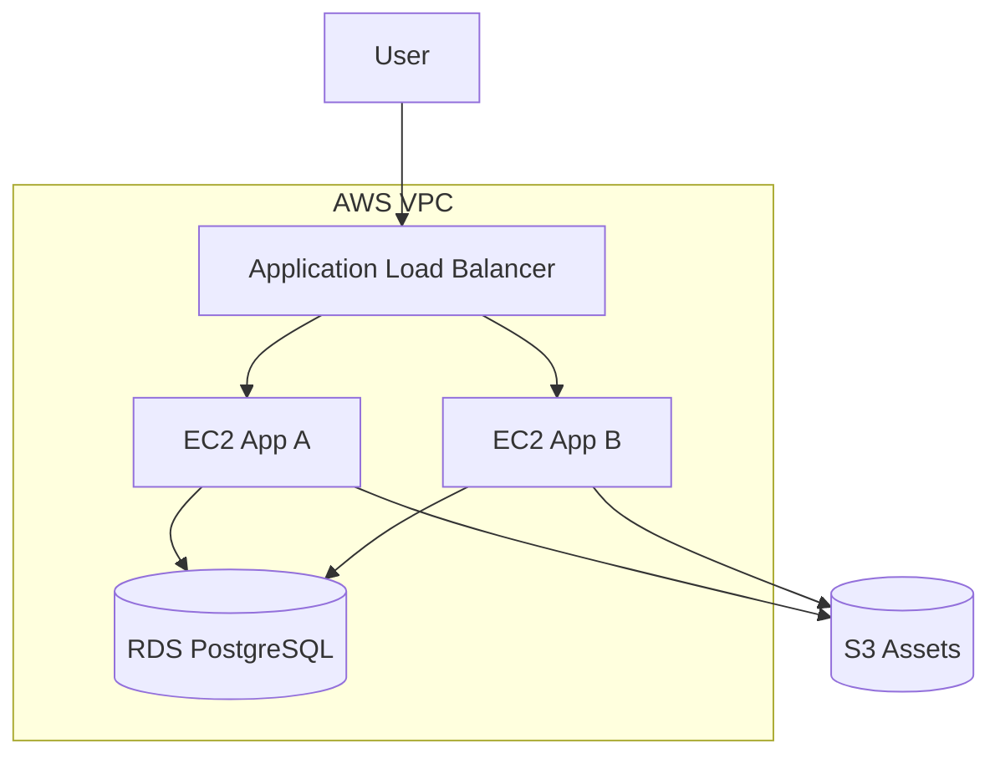

# aws-terraform-infra


Production-style AWS infrastructure with Terraform.

This repository provisions a reusable AWS foundation for a web application:
- VPC with public and private subnets across two availability zones
- Internet Gateway and NAT Gateway
- Security groups for ALB, EC2, and RDS
- Application Load Balancer
- EC2 application instances
- PostgreSQL RDS in private subnets
- S3 bucket for artifacts/static assets
- Remote state backend with S3 + DynamoDB locking
- Multi-environment configuration with tfvars

## Architecture



## Repository Layout

```text
.
├── modules/
│   ├── vpc/
│   ├── alb/
│   ├── ec2_app/
│   └── rds/
├── docs/
├── examples/complete/
├── files/
├── templates/
└── .github/workflows/
```

## Features

- Reusable module structure
- Environment variables via `terraform.tfvars`
- CI validation workflow on every push and pull request
- Opinionated but interview-friendly layout

## Quick Start

> **Local validation** (no AWS credentials required):

```bash
cp terraform.tfvars.example terraform.tfvars
terraform init -backend=false
terraform fmt -recursive
terraform validate
```

> **Full deployment** (requires AWS credentials and pre-created S3 backend):

```bash
terraform init
terraform plan
terraform apply
```

## Remote State

Create backend resources once, then configure `backend.hcl` or update `backend.tf` values for your bucket and DynamoDB table.

## Example environments

- `terraform.tfvars.example` shows a `dev` setup
- You can maintain `dev.tfvars`, `stage.tfvars`, `prod.tfvars`

## Notes

This starter is designed for portfolio use and can be extended with Auto Scaling Groups, CloudFront, ACM, Route53, ECR, and GitHub Actions deployment pipelines.

---

## 🔗 Part of the DevOps Portfolio Series

This repository is part of a full lifecycle DevOps portfolio demonstrating infrastructure, configuration, CI/CD, observability, and automation.

| # | Repository | Stack | Status |
|---|------------|-------|--------|
| 1 | **aws-terraform-infra** | Terraform · AWS · VPC · ALB · EC2 · RDS · S3 | ✅ You are here |
| 2 | ansible-server-setup | Ansible · Nginx · Docker · Linux · TLS | ⏳ In progress |
| 3 | ci-cd-pipeline-demo | GitHub Actions · Docker · ECR · EC2 · Blue-Green | ⏳ Planned |
| 4 | monitoring-stack | Prometheus · Grafana · Loki · Alertmanager | ⏳ Planned |
| 5 | k8s-helm-app | k3s · Helm · Traefik · cert-manager · MySQL | ⏳ Planned |
| 6 | lambda-automation | AWS Lambda · Python · IAM · CloudWatch | ⏳ Planned |
