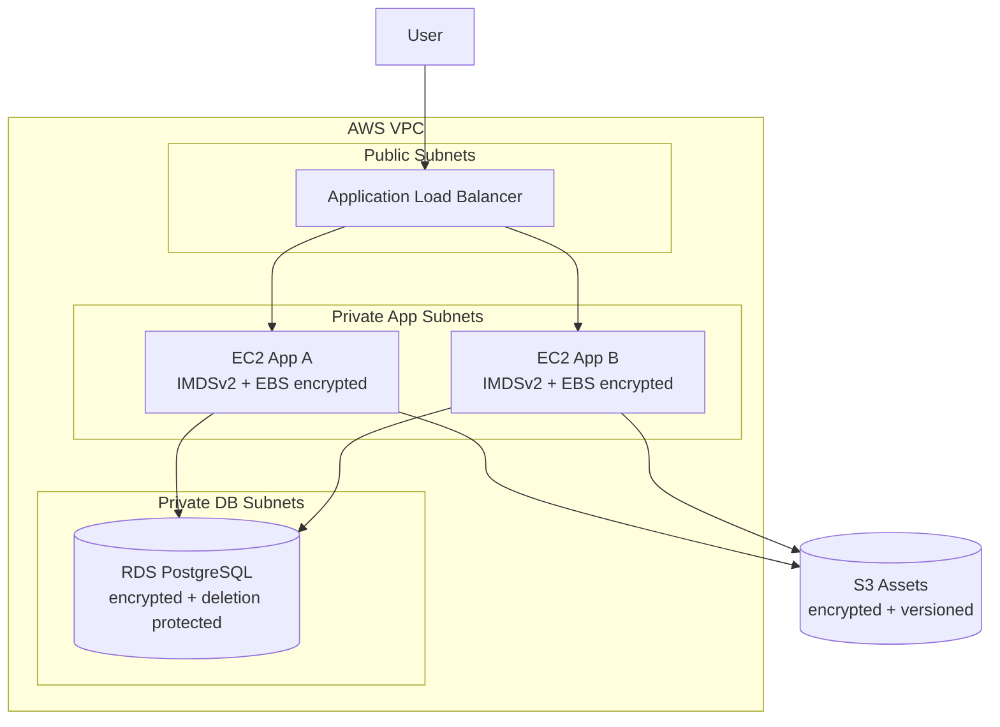

# aws-terraform-infra


Production-hardened AWS infrastructure with Terraform — VPC, ALB, EC2, RDS PostgreSQL, S3.

This repository provisions a reusable, security-focused AWS foundation for a web application with:

- VPC with public and private subnets across two availability zones
- Internet Gateway and NAT Gateway
- Security groups (ALB → EC2 → RDS, least-privilege)
- Application Load Balancer with HTTPS-ready target group
- EC2 application instances (IMDSv2 enforced, EBS encrypted, SSH CIDR-restricted)
- PostgreSQL RDS in private subnets (encrypted at-rest, deletion protection, daily backups)
- S3 bucket with versioning, AES256 encryption, and public access fully blocked
- Remote state backend with S3 + native locking (`use_lockfile`)
- Multi-environment configuration via tfvars

## Architecture



## Repository Layout

```text
.
├── modules/
│   ├── vpc/          # VPC, subnets, IGW, NAT GW, route tables
│   ├── alb/          # Application Load Balancer + security group
│   ├── ec2_app/      # EC2 instances + ASG-ready, IMDSv2, EBS encryption
│   └── rds/          # RDS PostgreSQL, encrypted, deletion-protected
├── .github/workflows/
│   └── terraform.yml # CI: validate → tfsec → plan (PR) → apply (main)
├── docs/
├── examples/complete/
├── files/
│   └── user_data.sh
├── templates/
├── main.tf
├── variables.tf
├── outputs.tf
├── locals.tf
├── backend.tf
├── versions.tf
├── providers.tf
├── .tflint.hcl
├── terraform.tfvars.example
├── SECURITY.md
└── LICENSE
```

## CI/CD Pipeline

Every push and pull request triggers the full pipeline:

```
PR opened
  └── validate     → terraform fmt -check, init, validate, tflint
        └── security → tfsec (AWS misconfiguration and CVE scan)
              └── plan   → terraform plan posted as PR comment

Merge to main
  └── validate → apply (requires manual approval via GitHub Environment: production)

Daily 06:00 UTC
  └── validate (drift detection — alerts if infra drifted from code)
```

## Secrets and Variables

Sensitive values are **never** committed to the repository. Supply them at runtime:

```bash
# Option A: environment variable (CI/CD)
export TF_VAR_db_password="your-secure-password"

# Option B: tfvars file (local only, .gitignored)
echo 'db_password = "your-secure-password"' >> terraform.tfvars
```

Required GitHub Actions Secrets (set in repo Settings → Secrets):

| Secret | Description |
|--------|-------------|
| `AWS_ACCESS_KEY_ID` | IAM access key (use OIDC in production instead) |
| `AWS_SECRET_ACCESS_KEY` | IAM secret key |
| `AWS_DEFAULT_REGION` | AWS region (e.g. `eu-central-1`) |
| `TF_VAR_DB_PASSWORD` | RDS master password |

> **Production recommendation:** Replace static IAM keys with [OIDC federation](https://docs.github.com/en/actions/security-for-github-actions/security-hardening-your-deployments/configuring-openid-connect-in-amazon-web-services) (`aws-actions/configure-aws-credentials` with role ARN). This eliminates long-lived credentials entirely.

## Environment-Specific Configuration

| Variable | dev | prod |
|----------|-----|------|
| `rds_deletion_protection` | `false` | `true` |
| `rds_skip_final_snapshot` | `true` | `false` |
| `rds_backup_retention_period` | `1` | `7` |
| `ssh_allowed_cidrs` | `["10.0.0.0/8"]` | `[]` (disabled) |

Use separate tfvars files per environment:

```bash
terraform apply -var-file=envs/dev.tfvars
terraform apply -var-file=envs/prod.tfvars
```

## Quick Start

> **Local validation** (no AWS credentials required):

```bash
cp terraform.tfvars.example terraform.tfvars
# Edit terraform.tfvars — set required values
terraform init -backend=false
terraform fmt -recursive
terraform validate
tflint --recursive
```

> **Full deployment** (requires AWS credentials and pre-created S3 backend):

```bash
# 1. Create S3 bucket + enable versioning + create DynamoDB table (once)
# 2. Update backend.tf with your bucket name
terraform init
terraform plan -var-file=envs/dev.tfvars
terraform apply -var-file=envs/dev.tfvars
```

## Remote State Backend

```hcl
# backend.tf — update bucket/region before terraform init
terraform {
  backend "s3" {
    bucket       = "YOUR-BUCKET-NAME-tf-state"
    key          = "aws-terraform-infra/dev/terraform.tfstate"
    region       = "eu-central-1"
    use_lockfile = true   # native S3 locking (Terraform >= 1.10)
    encrypt      = true
  }
}
```

> Enable S3 bucket versioning and restrict access via bucket policy. See `docs/` for a bootstrap script.

## Security Hardening Applied

| Resource | Hardening |
|----------|-----------|
| EC2 | IMDSv2 required, EBS encrypted (gp3), SSH CIDR-restricted |
| RDS | Storage encrypted (AES256), deletion protection, daily backups, no public access |
| S3 | AES256 SSE, versioning enabled, all public access blocked |
| CI | tfsec scan on every PR, secrets via GitHub Secrets only |
| Terraform | Provider version pinned (`~> 5.98`), `sensitive = true` on passwords |

---

## 🔗 Part of the DevOps Portfolio Series

| # | Repository | Stack |
|---|---|---|
| 1 | 👉 **[aws-terraform-infra](https://github.com/samarets-vlad/aws-terraform-infra)** | Terraform · AWS · VPC · ALB · EC2 · RDS · S3 |
| 2 | [ansible-server-setup](https://github.com/samarets-vlad/ansible-server-setup) | Ansible · Nginx · Docker · Linux · TLS |
| 3 | [docker-ecr-ec2-pipeline](https://github.com/samarets-vlad/docker-ecr-ec2-pipeline) | GitHub Actions · Docker · ECR · EC2 |
| 4 | [monitoring-stack](https://github.com/samarets-vlad/monitoring-stack) | Prometheus · Grafana · Alertmanager · Ansible |
| 5 | [k8s-helm-app](https://github.com/samarets-vlad/k8s-helm-app) | k3s · Helm · Traefik · cert-manager · MySQL |
| 6 | [serverless-aws-pipeline](https://github.com/samarets-vlad/serverless-aws-pipeline) | Terraform · Lambda · API GW · S3 · CloudFront |
